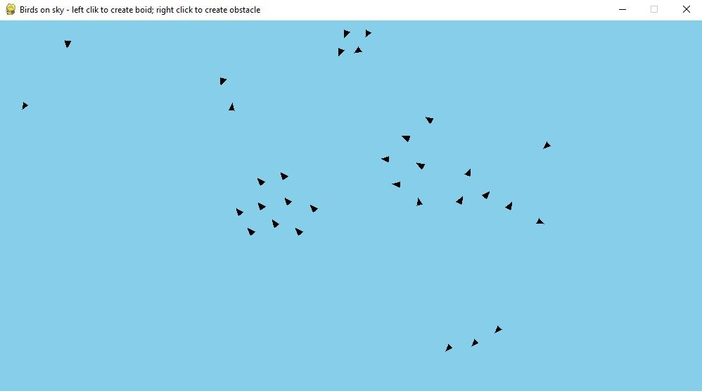

# boids

Basic Raynolds boids flocking model implementation.

- [boids](#boids)
  - [Pictures](#pictures)
  - [Technologies](#technologies)

## Pictures

## Technologies
Version of project:
* Python 3.X

